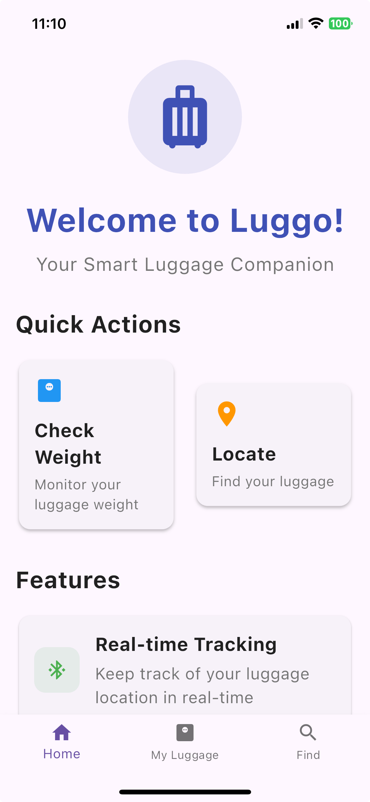
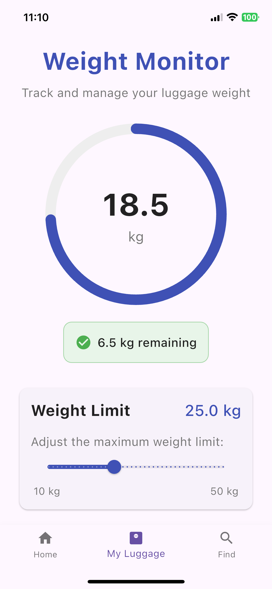
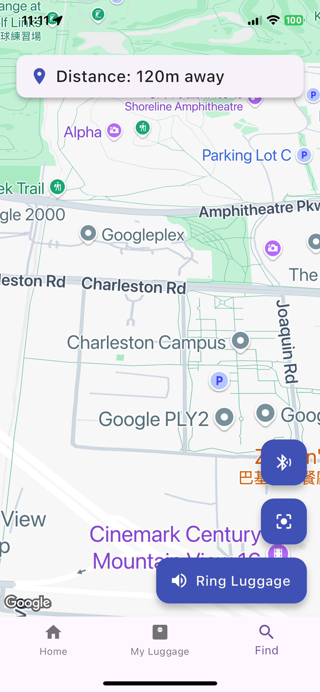

# Luggo - Smart Luggage App 🧳📱

<p align="center">
  
</p>

## About Luggo

Luggo is a smart luggage companion app designed to enhance your travel experience. It combines real-time weight monitoring and location tracking features to help travelers manage their luggage efficiently.

### Key Features

- **Weight Monitoring**
  - Real-time weight tracking
  - Customizable weight limits
  - Instant alerts for overweight luggage
  - Visual weight status indicators

- **Location Tracking**
  - GPS-based luggage tracking
  - Interactive map interface
  - Distance indicators
  - "Ring Luggage" feature for easy locating
  - Zoom controls for precise location viewing

### Technical Features

- Built with Flutter for iOS
- Google Maps integration for location services
- Real-time weight monitoring system

## Landing Page
Check out our landing page here: https://alexl011.github.io/luggo-landing-page/ 


## 📸 Screenshots
Luggo helps you monitor your luggage weight, track its real-time location, and find it easily using Bluetooth and GPS technology.

| Home Screen | Weight Monitor | Find Luggage |
|:-----------:|:-------------:|:------------:|
|  |  |  |


## 🛠️ Frameworks & Packages Used

- [Flutter](https://flutter.dev/) – Cross-platform mobile framework
- [google_maps_flutter](https://pub.dev/packages/google_maps_flutter) – Google Maps integration
- [percent_indicator](https://pub.dev/packages/percent_indicator) – Circular percent indicators
- [shared_preferences](https://pub.dev/packages/shared_preferences) – Local storage
- [flutter_blue_plus](https://pub.dev/packages/flutter_blue_plus) – Bluetooth communication
- [geolocator](https://pub.dev/packages/geolocator) – Device location services

## 🚀 Installation & Running the App

### Prerequisites
- [Flutter SDK](https://flutter.dev/docs/get-started/install) (version 3.2.3 or higher)
- Dart SDK (comes with Flutter)
- Xcode (for iOS development)
- A device or emulator

### Plugin Versions Used
This project uses the following plugin versions (see `pubspec.yaml` for details):
- `google_maps_flutter: ^2.5.3`
- `percent_indicator: ^4.2.3`
- `shared_preferences: ^2.2.2`
- `flutter_blue_plus: ^1.31.16`
- `location: ^5.0.3`
- `provider: ^6.1.1`
- `geolocator: ^11.0.0`

### Setup Instructions

1. **Clone the repository:**
   ```sh
   git clone https://github.com/alexl011/CASA0015-Mobile-Systems-project.git
   cd CASA0015-Mobile-Systems-project
   ```

2. **Install dependencies:**
   ```sh
   flutter pub get
   ```

3. **(iOS only) Install CocoaPods dependencies:**
   ```sh
   cd ios
   pod install
   cd ..
   ```

4. **Run the app:**
     ```sh
     flutter run
     ```

5. **Permissions:**
   - Make sure to allow location and Bluetooth permissions on your device.


##  Contact Details

Please contact through my personal email: shihhungl0110@gmail.com
